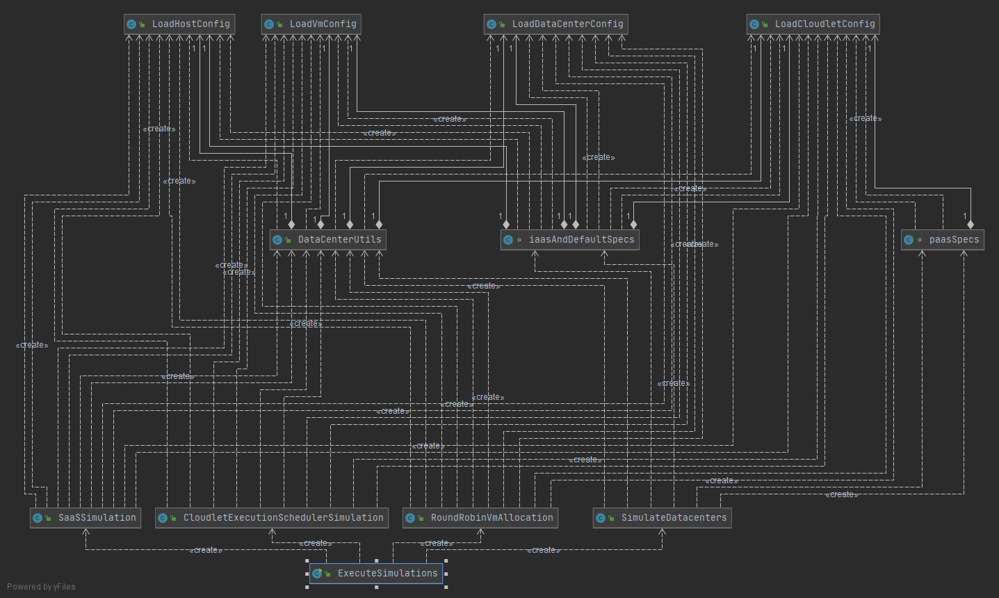
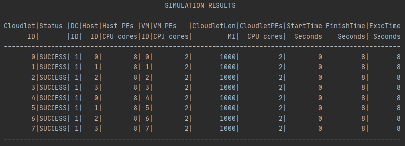

# Homework 1

### Description: create cloud simulators for evaluating executions of applications in cloud datacenters with different characteristics and deployment models.
## Application Design

The program uses the [Cloud Sim Plus](http://cloudsimplus.org/) framework to create simulations of executing jobs on a cloud computing datacenter. Cloud Sim Plus is a software library that models the cloud environments and helps to operate different cloud models. This framework provides interfaces and classes to implement and simulate hosts, VMs, and cloudlets in a datacenter.

Class UML diagram for the application:



### Some Important Files

- `LoadDataCenterConfig`, `LoadHostConfig`, `LoadVmConfig` and `LoadCloudletConfig` are utility classes to parse the specifications for a datacenter from an input config file.

  Here is the structure of `LoadDataCenterConfig` class:

  

  ```java
  public class LoadDataCenterConfig {
      Config conf;
      int numberOfHosts, numberOfVms,numberOfCloudlets;
      String arch, os, vmm;
      double costPerSecond ,costPerMem, costPerStorage, costPerBw;
  
      public LoadDataCenterConfig(String simulationType,int simulNum, int index) {
          conf = ConfigFactory.load(simulationType);
          String configItem = "simulation"+simulNum+"."+"dataCenter"+index+".";
          numberOfHosts = conf.getInt(configItem + "numberOfHosts");
          numberOfVms = conf.getInt(configItem + "numberOfVms");
          numberOfCloudlets = conf.getInt(configItem + "numberOfCloudlets");
          arch = conf.getString(configItem + "arch");
          os = conf.getString(configItem + "os");
          vmm = conf.getString(configItem + "vmm");
          costPerSecond = conf.getDouble(configItem + "costPerSecond");
          costPerMem = conf.getDouble(configItem + "costPerMem");
          costPerStorage = conf.getDouble(configItem + "costPerStorage");
          costPerBw = conf.getDouble(configItem + "costPerStorage");
      }
  }
  ```

  The classes `LoadHostConfig`, `LoadVmConfig` and `LoadCloudletConfig` also similarly parse specifications from config files.

- `DataCenterUtils` is a utility class which defines methods for creating a datacenter and its constituent components like hosts, VMs and cloudlets.


The methods `createHost()`, `createHostList()`, `createVm()`, `createVmList()`, `createCloudlet()`, `createCloudletList()` and `createDatacenter()` have overloaded definitions.

The method `executionCost()` returns the overall cost of execution of a list of cloudlets for a particular broker.

- The class `CloudletExecutionSchedulerSimulation` is for simulating different execution schedulers available in cloud sim plus.

  

  A simple datacenter is created with 1 host, 1 VM and 2 cloudlets for execution.

  Depending on the `vmScheduler` and `cloudletScheduler` instances provided to the class constructor, a Time Shared or Space Shared VM scheduling policy will be simulated.

- The class `RoundRobinVmAllocation` is for simulation that shows the usage of the VmAllocationPolicyRoundRobin, that cyclically assigns VMs to Hosts.

  

- The class `SaaSSimulation` is for simulating an execution of a simple datacenter running on Software as a Service(SaaS) model.

  

  At the end of execution of cloudlet(s), it outputs the cost of execution.

- The class `ExecuteSimulations` is the main class for running all simulations at once.

  

------


## Simulations

1. Space Shared VM Scheduling Simulation

(Refer [SpaceShared.conf]() for simulation inputs)

A simulation showing a datacenter with 1 host, 1 VM and running 2 cloudlets on it, that will run sequentially.


In this simulation, each cloudlet runs for 10 seconds sequentially for a total execution time of 20 seconds.

First cloudlet 1 executes and cloudlet 2 waits until 1 completes its executions. After cloudlet 1 completes the other cloudlet does the same. 

At one instant of time there is only one cloudlet running on the VM and each one uses all the VM's CPU capacity while executing. In this manner, one cloudlet finishes prior to the other, but the execution time (the time using the processor) of each cloudlet is the same, given the cloudlets are equivalent in terms of resource requirements. 

While using the space shared cloudlet scheduler, the first cloudlet is not interrupted by the next cloudlet when it starts to run because of the non-preemptive nature of the scheduler.

------

2. Time Shared VM Scheduling Simulation

(Refer [TimeShared.conf]() for simulation inputs)

A simulation showing a datacenter with 1 host, 1 VM and running 2 cloudlets on it, that will compete for the VM's CPU execution time.


In this simulation, each cloudlet runs for 20 seconds in total while sharing VM’s CPU time, hence total time of simulation is also 20 seconds.

The VM's CPU is shared among the cloudlets using a Time Shared VM scheduler, that performs a preemptive scheduling.

Each cloudlet gets a quantum of time to use the VM's CPU. Additionally, if both cloudlets have the same length, and they start and finish together. 

Thus, the execution time for completion of both cloudlets is double the time duration compared to running each cloudlet in its own VM (i.e. using a space shared scheduler).

------

3. Round Robin VM Allocation Simulation

(Refer [RoundRobin.conf]() for simulation inputs)

A simulation showing the usage of the VmAllocationPolicyRoundRobin for assigning VMs to cloudlets for execution. This policy cyclically places a VM into a Hosts and moves to the next Host.

All hosts are not powered-on when created. As VMs need to be placed, Hosts are activated on demand (as can be checked in the log file).

Such policies are naïve and can increase the number of active Hosts thus leading to higher power consumption.



In this simulation, the datacenter has 4 hosts, 8 VMs and 8 cloudlets for execution. 

VMs use a Time Shared scheduling policy for cloudlets by default, thus all cloudlets complete execution at the same time (800 secs).

------

4. Software as a Service Model Simulation

   The users of SaaS model do not have any access to the underlying hardware or the operating system or other low-level components of the application platform. The clients do not have a choice of the platform on which SaaS applications are deployed, they are often not even given interfaces to obtain the information about the platform. 

   Thus for a SaaS broker, it is imperative to choose the most appropriate stack on which the application will be run by the end user, to reduce overall cost of the service. 

   This can be achieved by executing a set of cloudlets with different VMs, scheduling policies, and prices of execution. The stack with lowest cost per execution can be selected as the most optimal stack to run the particular application.

   (Refer [SaaSSim.conf]() for simulation inputs)

   Two datacenter with 2 hosts, 4 VMs and 4 cloudlets are created. Each datacenter has similar configuration for the hosts and VMs except their cost of execution are different. After simulating cloudlet execution on both datacenters, the datacenter with lowest cost should be the optimal stack.

   For simplicity the Vm allocation policy, Vm and cloudlet schedulers are set to default.

   1. Simulation 1

      ```json
      dataCenter1 = {
        numberOfHosts = 2
        numberOfVms = 4
        numberOfCloudlets = 4
        arch = "x86"
        os = "Linux"
        vmm = "Hyper-V"
        costPerSecond = 1.5
        costPerMem = 0.05
        costPerStorage = 0.001
        costPerBw = 0.0006
      }
      ```

      

   2. Simulation 2

      ```json
      dataCenter1 = {
        numberOfHosts = 2
        numberOfVms = 4
        numberOfCloudlets = 4
        arch = "x86"
        os = "Linux"
        vmm = "Xen"
        costPerSecond = 1.0
        costPerMem = 0.02
        costPerStorage = 0.0005
        costPerBw = 0.0001
      }
      ```

      

   On comparing the results of simulations, it is evident that the cost of execution per cloudlet is about $100 lower for the 2nd datacenter. But interestingly the time of execution is 100 secs higher for the 2nd datacenter. 

   So as a cloud broker, if cost per execution is a priority then datacenter 2 should be optimal choice. On the other hand, if execution time is a priority then datacenter 1 will be optimal choice, however at higher cost per execution.

------


------

## Instructions to Execute